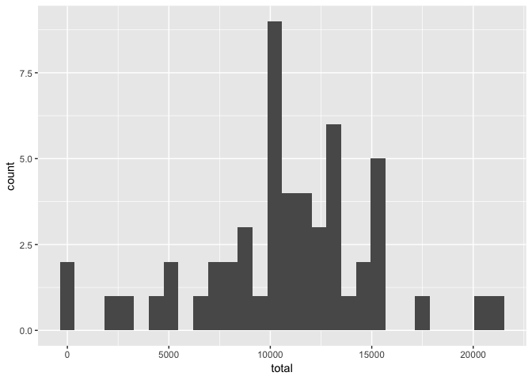
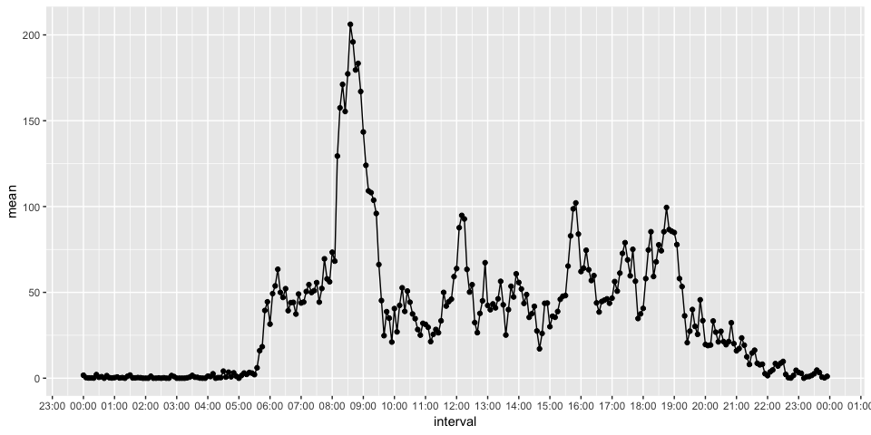
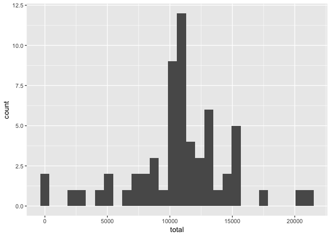
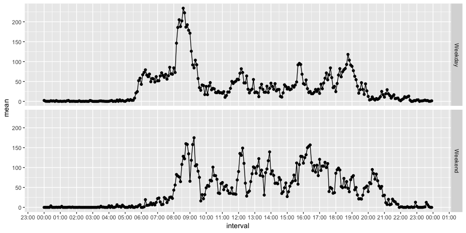

```r
library(knitr)
opts_chunk$set(message = FALSE, echo = TRUE)
```

First, let's import the packages we are going to use. 


```r
library(data.table)
library(dplyr)
library(ggplot2)
library(hms)
library(lubridate)
library(stringr)
```

The **data.table** and **dplyr** packages are important to manipulate datasets 
more efficiently. The **ggplot2** package is to plot using the homonymous plotting
system. The **hms** and **lubridate** packages help when working with time and
date variables whereas the **stringr** package is useful to deal with strings.


## Step One

Let's load the dataset as a `data.table` (using the `fread()` function) and 
change the date variable to a "Date" type instead of "character". It's important
to first set your working directory to the folder where the `.csv` file is using
the `setwd()` function.


```r
foo <- fread("activity.csv")
foo <- foo %>% 
  mutate(date = ymd(date)) %>% 
  as.data.table()
```


## Step Two

First we aggregate the number of steps by date (excluding missing values). 
Then we plot the histogram of the total number of steps.


```r
dt <- foo[steps != "NA", .(total = sum(steps)), by = .(date)]
ggplot(data = dt) + aes(x = total) + geom_histogram()
```




## Step Three

The next step is to take the mean and median of the total number of steps taken
each day. 


```r
mean_median <- dt %>% 
  summarize(mean = mean(total),
            median = median(total))
mean_median
```

```
##       mean median
## 1 10766.19  10765
```


## Step Four

Plotting a time series of the average number of steps taken in the 5-minute
interval:


```r
foo <- foo %>% 
  mutate(interval = interval %>% as.character %>% str_pad(width = 4, pad = "0"))

foo <- foo %>% 
  mutate(interval = paste(str_sub(interval, 1, 2), str_sub(interval, 3, 4), sep = ":")) %>% 
  mutate(interval = parse_hm(interval)) %>% 
  mutate(interval = as.POSIXct(interval)) %>%
  as.data.table()

dt <- foo[steps != "NA", .(mean = mean(steps)), by = .(interval)]
ggplot(data = dt, aes(x = interval, y = mean)) + 
  geom_point() +
  geom_line() + 
  scale_x_datetime(breaks = scales::date_breaks("1 hour"),
                   date_labels = "%H:%M")
```




## Step Five

From the plot, it's possible to see that the 5-minute interval that, on average,
contains the maximum number of steps is after 08:30 and before 09:00.
To know the exact interval, we can do the following:


```r
dt <- dt %>% mutate(interval = as.hms(interval, tz = 'UTC')) %>% as.data.table()
dt[order(-mean)][1,]
```

```
##    interval     mean
## 1: 08:35:00 206.1698
```


## Step Six

### Describing

Checking how many rows exist with missing values in this dataset:

```r
missing_rows <- foo[!complete.cases(foo)] %>% nrow
```

Thus, from 17568 rows, there are 2304 with missing values. 
Which is about 13% of the 
dataset.

We can verify which variables are responsible for these missing values

```r
prop_NA <- sapply(foo, function(x) mean(is.na(x)))
prop_NA
```

```
##     steps      date  interval 
## 0.1311475 0.0000000 0.0000000
```


Only the `steps` variable has missing values.
We can also investigate the proportion of missing values in each day.


```r
prop_NA_by_day <- foo[, .(prop_NA = mean(is.na(steps))), by = .(date)]
prop_NA_by_day
```

```
##           date prop_NA
##  1: 2012-10-01       1
##  2: 2012-10-02       0
##  3: 2012-10-03       0
##  4: 2012-10-04       0
##  5: 2012-10-05       0
##  6: 2012-10-06       0
##  7: 2012-10-07       0
##  8: 2012-10-08       1
##  9: 2012-10-09       0
## 10: 2012-10-10       0
## 11: 2012-10-11       0
## 12: 2012-10-12       0
## 13: 2012-10-13       0
## 14: 2012-10-14       0
## 15: 2012-10-15       0
## 16: 2012-10-16       0
## 17: 2012-10-17       0
## 18: 2012-10-18       0
## 19: 2012-10-19       0
## 20: 2012-10-20       0
## 21: 2012-10-21       0
## 22: 2012-10-22       0
## 23: 2012-10-23       0
## 24: 2012-10-24       0
## 25: 2012-10-25       0
## 26: 2012-10-26       0
## 27: 2012-10-27       0
## 28: 2012-10-28       0
## 29: 2012-10-29       0
## 30: 2012-10-30       0
## 31: 2012-10-31       0
## 32: 2012-11-01       1
## 33: 2012-11-02       0
## 34: 2012-11-03       0
## 35: 2012-11-04       1
## 36: 2012-11-05       0
## 37: 2012-11-06       0
## 38: 2012-11-07       0
## 39: 2012-11-08       0
## 40: 2012-11-09       1
## 41: 2012-11-10       1
## 42: 2012-11-11       0
## 43: 2012-11-12       0
## 44: 2012-11-13       0
## 45: 2012-11-14       1
## 46: 2012-11-15       0
## 47: 2012-11-16       0
## 48: 2012-11-17       0
## 49: 2012-11-18       0
## 50: 2012-11-19       0
## 51: 2012-11-20       0
## 52: 2012-11-21       0
## 53: 2012-11-22       0
## 54: 2012-11-23       0
## 55: 2012-11-24       0
## 56: 2012-11-25       0
## 57: 2012-11-26       0
## 58: 2012-11-27       0
## 59: 2012-11-28       0
## 60: 2012-11-29       0
## 61: 2012-11-30       1
##           date prop_NA
```

When the missing values appear, they do appear throught every interval of the day.  


### Imputing missing data

There are multiples ways to imput missing data. 
Here we will use the mean of the steps for the complete period to address the missing data issue.


```r
bar <- copy(foo)
bar[is.na(steps), steps := mean(foo$steps, na.rm = T)]
bar
```

```
##        steps       date            interval
##     1:    37 2012-10-01 1970-01-01 00:00:00
##     2:    37 2012-10-01 1970-01-01 00:05:00
##     3:    37 2012-10-01 1970-01-01 00:10:00
##     4:    37 2012-10-01 1970-01-01 00:15:00
##     5:    37 2012-10-01 1970-01-01 00:20:00
##    ---                                     
## 17564:    37 2012-11-30 1970-01-01 23:35:00
## 17565:    37 2012-11-30 1970-01-01 23:40:00
## 17566:    37 2012-11-30 1970-01-01 23:45:00
## 17567:    37 2012-11-30 1970-01-01 23:50:00
## 17568:    37 2012-11-30 1970-01-01 23:55:00
```


## Step Seven 

Histogram of the total number of steps taken each day after missing values are imputed


```r
dt2 <- bar[, .(total = sum(steps)), by = .(date)]
ggplot(data = dt2) + aes(x = total) + geom_histogram()
```




## Step Eight

Let's investigate if there is any change on the activity pattern between 
weekdays and weekends before and after imputation.

We first need to create a variable that indicates if that date is a weekday or a
weekend.


```r
foo <- foo %>% 
  mutate(type_of_day = wday(date, label = T)) %>% 
  mutate(type_of_day = ifelse(type_of_day %in% c("Sat", "Sun"),
                              "Weekend", "Weekday")) %>% 
  as.data.table()
```


Now we plot the average number of steps taken per 5-minute interval comparing
weekdays and weekends before the imputation.


```r
dt <- foo[steps != "NA", .(mean = mean(steps)), by = .(interval, type_of_day)]
ggplot(data = dt, aes(x = interval, y = mean)) + 
  geom_point() +
  geom_line() + 
  facet_grid(rows = vars(type_of_day)) + 
  scale_x_datetime(breaks = scales::date_breaks("1 hour"),
                   date_labels = "%H:%M")
```




We can also do the same thing to the dataset after imputation of missing values.

First we create the variable to distingish if the day is a weekday or a weekend.


```r
bar <- bar %>% 
  mutate(type_of_day = wday(date, label = T)) %>% 
  mutate(type_of_day = ifelse(type_of_day %in% c("Sat", "Sun"),
                              "Weekend", "Weekday")) %>% 
  as.data.table()
```


Now we plot the average number of steps taken per 5-minute interval comparing
weekdays and weekends after the imputation.


```r
dt2 <- bar[, .(mean = mean(steps)), by = .(interval, type_of_day)]
ggplot(data = dt2, aes(x = interval, y = mean)) + 
  geom_point() +
  geom_line() + 
  facet_grid(rows = vars(type_of_day)) + 
  scale_x_datetime(breaks = scales::date_breaks("1 hour"),
                   date_labels = "%H:%M")
```


From the previous plots, we can say that during weekends people do not seem to 
take much steps from 06:00 to 08:00. Additionally, the average steps taken from 
08:00 to 21:00 has a smaller variance on weekends when compared to weekdays.

